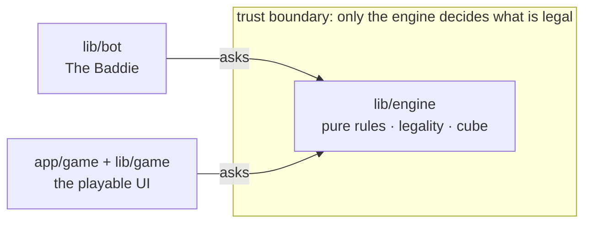

# Architecture

This is the deep read for anyone who wants to know whether the hard parts are actually correct. The short version: a backgammon rules engine is unforgiving, so the whole codebase is arranged to make correctness checkable in one place and impossible to bypass everywhere else.

## The one idea

**All legality lives in a single pure engine. Nothing else is allowed to decide what is legal.**



The bot and the UI are consumers. They ask the engine what moves exist and pick or submit among them. They never recompute the rules themselves. That single constraint is what keeps a familiar-but-fiddly game honest.

## Directory map

| Path | What it is |
|---|---|
| `lib/engine/` | The pure rules and cube engine. Board representation, legal move generation, the maximum-use rule, the bar, bear-off, win/gammon/backgammon scoring, and the full doubling cube. No React, no Next.js, no I/O. |
| `lib/bot/` | The Baddie: a 1-ply heuristic that picks the best move the engine offers, via a documented positional evaluation. Deterministic, no cube decisions in v1. |
| `lib/game/` | Pure UI-support helpers: persistence, move staging, phrases, view state. Also pure, also import-scanned. |
| `app/game/` | The React/Next.js client that renders engine state and plays a full game in the browser. |
| `lib/**/__tests__/` | The test suite (Vitest). Every test is named with a QA ID that maps to the feature's requirements. |

## Engine purity (and how it's enforced)

The engine is pure and framework-free: state in, state out, no side effects. That is not a guideline you have to trust, it is a test. `lib/engine/__tests__/purity.test.ts` statically scans every engine file's imports and asserts each one imports only sibling engine files. The bot has the same scan (`lib/bot/__tests__/purity.test.ts`): bot files may import only the engine's public API and sibling bot files. Any new pure module under `lib/` ships its own purity scan on the same pattern.

If an engine file ever reaches outside `lib/engine/`, the suite goes red. Purity is the engine's credibility claim, so it is machine-checked rather than promised.

## The trust boundary

All legality lives in the engine, and the bot and UI only select among plays the engine offers:

- The bot calls `chooseMove(state)`, which returns a `Play` or `null` (null means forfeit; the caller advances with `forfeitTurn`).
- The UI stages half-moves with `movesFrom` and submits a whole turn with `applyPlay`.

Neither the bot nor the UI ever constructs or mutates a `Play` outside what `legalPlays` / `movesFrom` return. This is a standing rule, not a convention of the moment: a UI or bot that hand-built a move could ship an illegal one, and the entire point of the project is that it cannot.

## Atomic turns

The engine only applies complete turns. `applyPlay` validates a turn by replaying its half-moves, and there is no public single-half-move mutation. A turn is legal or it is rejected as a whole, which is what makes the maximum-use rule enforceable at the one mutation boundary. `legalPlays` returns one canonical ordering per distinct resulting position, and `applyPlay` accepts any legal ordering, so consumers compare plays by the position they produce, not by move sequence.

## One coordinate system

There is one absolute board: points 1 to 24 from White's perspective. Every bit of side symmetry flows through a single helper, `pointFor(player, n)` in `lib/engine/board.ts`. No mirrored per-side math is written anywhere else, in the engine, the bot, or the UI. Scattered per-side logic is the classic source of backgammon direction bugs, so it is deliberately confined to one auditable function.

## Dice are inputs

Dice are inputs to the engine, not something it generates. The seedable roller (`lib/engine/dice.ts`, mulberry32) sits outside the engine core and is not cryptographic, which is fine for local single-player play and keeps the engine deterministic for tests. If adversarial or online play ever enters scope, dice would need a crypto or server-side source and a fresh review.

## Persistence

The playable client persists to `localStorage` only: a single versioned blob for the active game plus the win/loss record. On restore it is treated as untrusted data, structurally validated (including a 15-checker conservation check and a defensive `legalPlays` smoke check) and discarded on any failure, so a corrupt or stale save degrades to a fresh game instead of crashing. Any change to the saved shape bumps a schema version so old blobs are dropped cleanly. There is no server and no account.

## The test suite is the proof

The suite is 102 Vitest tests, each named with a QA ID that maps one-to-one to the feature's success metrics, plus the import-scan purity tests above. If you are evaluating correctness, that is where to look: the tricky cases (move generation, the maximum-use rule, the bar, bear-off edges, and the cube) are covered there by name.

```bash
npm test           # run the whole suite
npx tsc --noEmit   # type-check the entire repo, tests included
```

The type-check runs across the whole repo, including tests, so fixtures cannot quietly violate the engine's `readonly` contracts.
