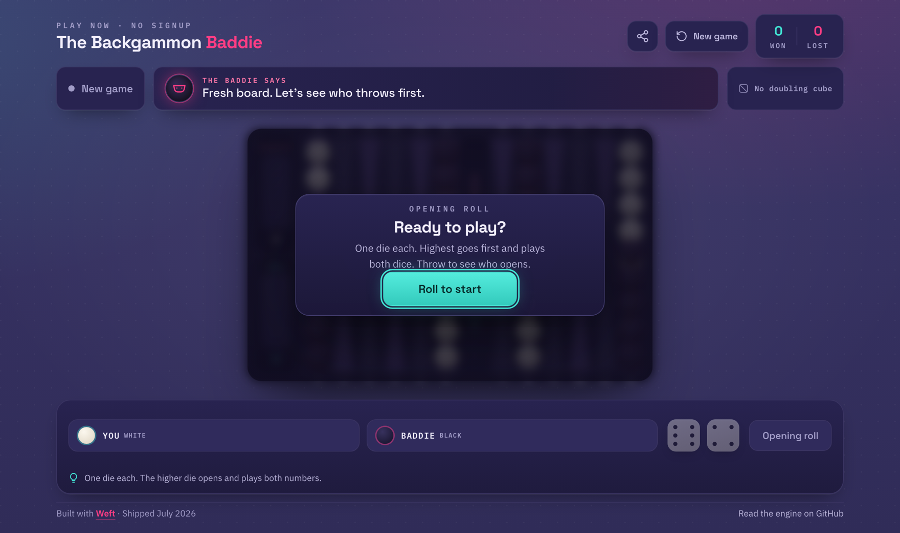
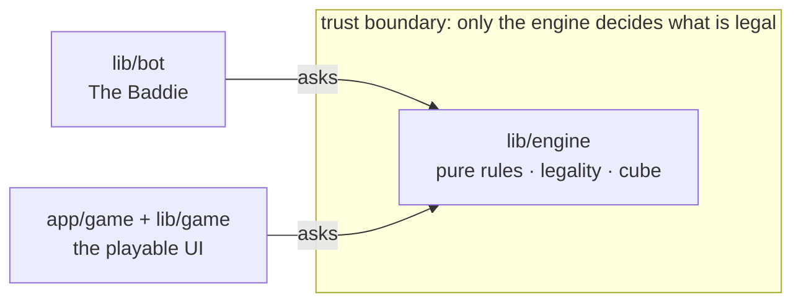

<div align="center">

# 🎲 The Backgammon Baddie

**A free, open-source backgammon game you can play in one click.
No account, no ads, just you against a cheeky computer opponent.**

[](https://thebackgammonbaddie.com)
[](LICENSE)

[](https://weft.build)



</div>

## Play it now

[**thebackgammonbaddie.com**](https://thebackgammonbaddie.com) puts you straight into a game. It runs in your browser, it is single-player, and it remembers your game and your win/loss record if you come back later.

The game opens the way real backgammon does: one die each, higher goes first and plays both numbers, and The Baddie will happily take the opening throw when it out-rolls you. Standard rules, no doubling cube in play yet.

## Run it locally

```bash
git clone https://github.com/devensimonson/backgammon-baddie.git
cd backgammon-baddie
npm install
npm run dev        # play at http://localhost:3000
```

Run the checks the project ships with:

```bash
npm test           # 102 tests (Vitest)
npx tsc --noEmit   # type-check the whole repo
npm run lint
```

## How it's built

The whole design rests on one idea: **all the rules live in a single pure engine, and nothing else is allowed to bend them.** The bot and the UI can only ask the engine what is legal. They never decide for themselves.



- **Pure and framework-free.** The engine has no React, no Next.js, no I/O. State in, state out. A test scans every import to prove it stays that way.
- **One source of truth.** Move generation, the maximum-use rule, the bar, bear-off, win/gammon/backgammon scoring, and the doubling cube all live in one place, with a visible test suite covering the tricky cases.
- **The UI can't cheat.** It only submits moves the engine offered. That guarantee is the whole point of the design.

The full tour is in [ARCHITECTURE.md](ARCHITECTURE.md). If you want to run it or contribute, see [CONTRIBUTING.md](CONTRIBUTING.md).

## Built with Weft

This is a real, tested, live product designed and built with [Weft](https://weft.build) across about five guided runs, from the rules engine to the bot to the playable board to this public release. Not a toy and not a snippet: a game you can open, play, and read the source of. That was the whole point.

## License

MIT. See [LICENSE](LICENSE).

## Tech

[Next.js](https://nextjs.org) (App Router) · React · TypeScript · [Vitest](https://vitest.dev) · deployed on [Vercel](https://vercel.com).
